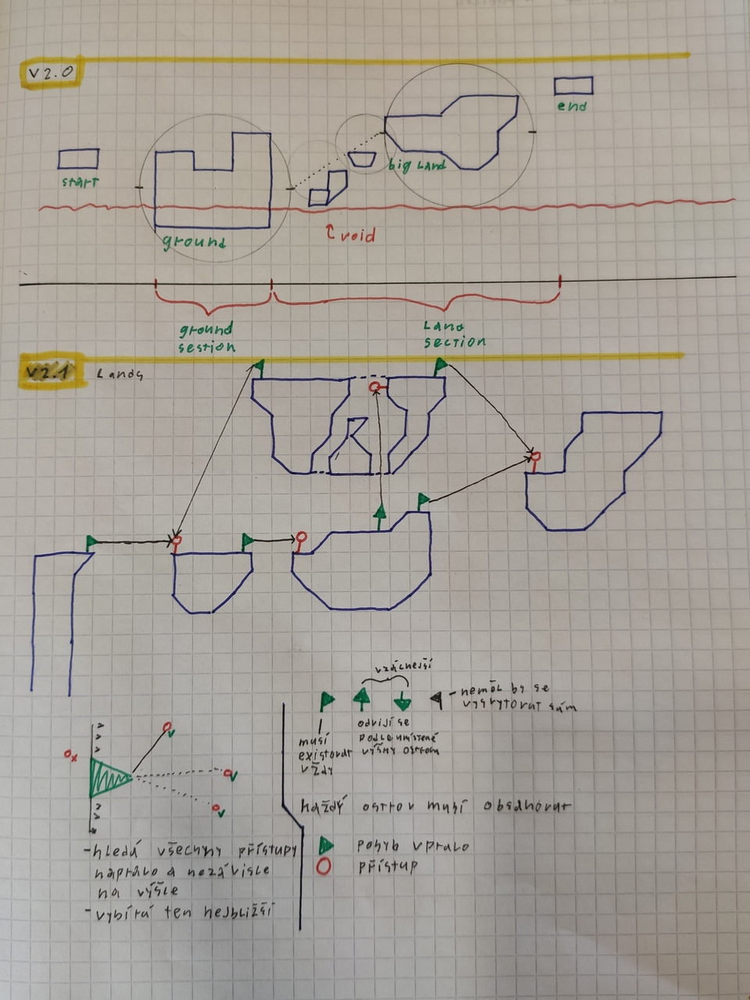

# TheObjectiveGame

*This repository contains students graduation work.*
*And this is our first bigger project in Unity.*
*Text below will be written in czech language.*

## Maturitní práce
##### Název: Unity 2D Skákačka hra
##### Forma a způsob zpracování:
> Student má za úkol vytvořit hru s využitím technologie Unity. Hra bude ovládána pomocí klávesnice a myši. Úkolem hráče bude hledat předměty v procedurálně vygenerovaném světě. V průběhu hry bude čelit více druhům nepřátel, které bude muset porazit nebo se jim nějakým způsobem vyhnout. Hráč bude mít možnost sbírat předměty, které upraví vlastnosti jeho postavy, například různé druhy zbraní. K dokončení hry musí hráč najít speciální stanovené předměty.

#### Poznámky v sešitě

### Todos

 - Menu
 - Generátor světa
 - Entity (hráč, základ pro nepřátele)
 - Grafický návhr
 - Systém inventáře
 - Zbraně
 - Grafika, textury

 ### Plán
  - Základní návrh: 30. 11.2020
  - Prototyp: 31. 12.2020

  - *what if the 2020 is maximum limit*